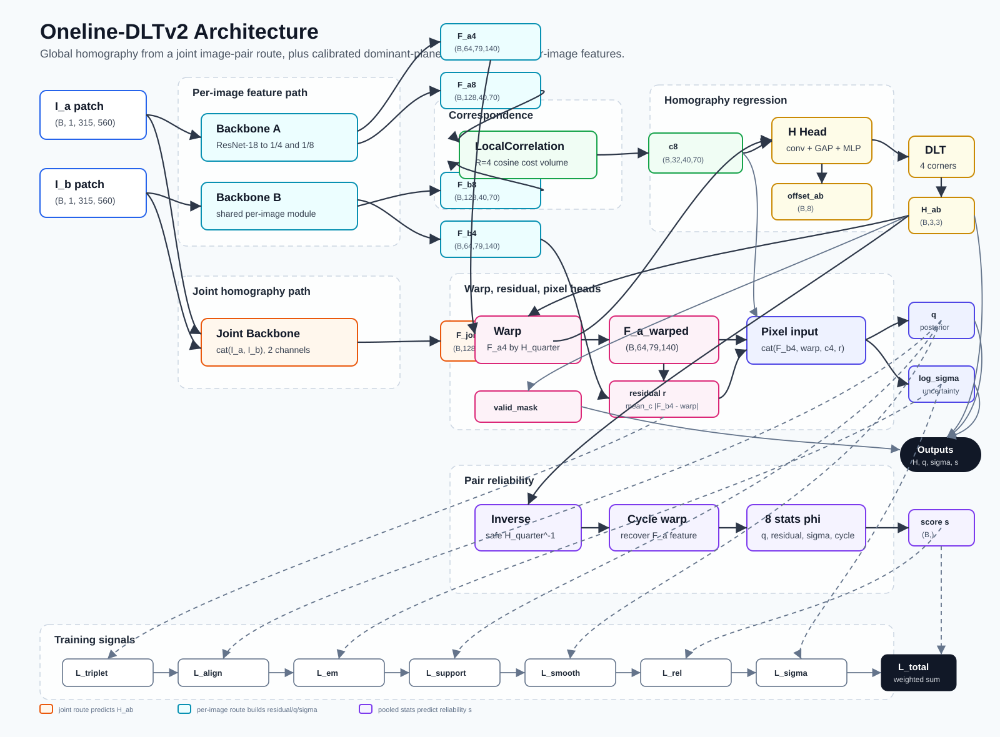
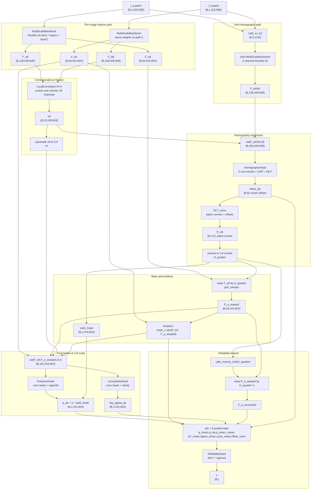
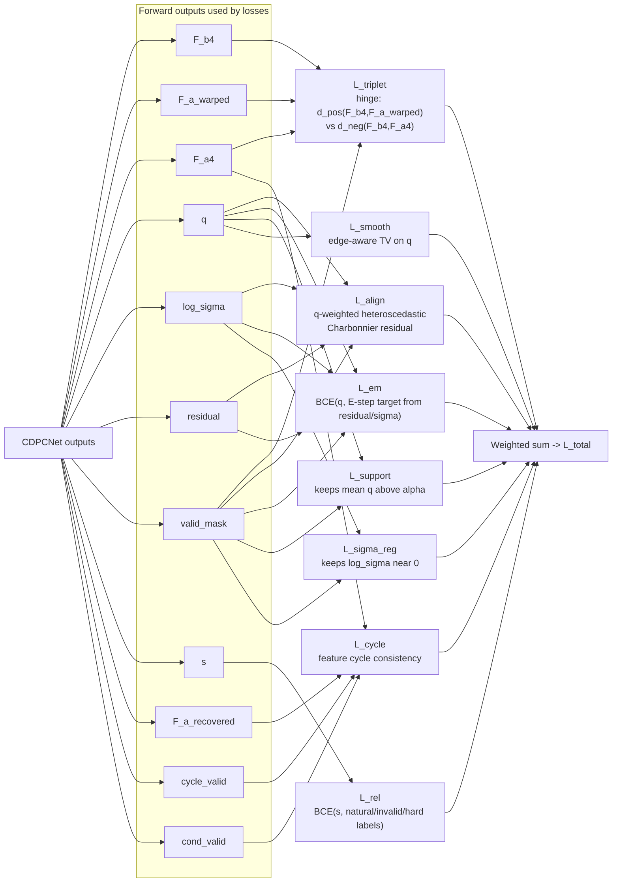

# Oneline-DLTv2 Architecture



This is the complete data flow implemented by `model/cdpc_net.py` and trained by
`train.py`. The central idea is:

- Use a joint 2-channel path to regress one global homography `H_ab`.
- Use separate per-image features to estimate dominant-plane support `q`,
  uncertainty `log_sigma`, residuals, and pair reliability `s`.
- Train everything with feature alignment, posterior calibration, reliability,
  support, smoothness, and optional cycle losses.

## Forward Pass



## One-Screen Summary

```text
Inputs:
  I_a, I_b grayscale patches: (B, 1, 315, 560)

Backbones:
  per-image backbone(I_a) -> F_a4, F_a8
  per-image backbone(I_b) -> F_b4, F_b8
  joint backbone(cat(I_a,I_b)) -> F_joint8

Matching:
  LocalCorrelation(F_a8, F_b8) -> c8

Homography:
  HomographyHead(cat(F_joint8,c8)) -> 8 corner offsets
  DLT_solve(corners, offsets) -> H_ab

Dominant-plane reasoning:
  warp(F_a4, H_ab at 1/4 scale) -> F_a_warped
  residual = mean_channel(abs(F_b4 - F_a_warped))
  cat(F_b4, F_a_warped, upsample(c8), residual) -> q, log_sigma

Reliability:
  analytic inverse + cycle warp + pooled q/residual/sigma/offset stats -> s

Main outputs:
  H_ab, H_ab_inv, offset_ab, q_ab, log_sigma_ab, residual_map_ab,
  reliability_score, feature_a, feature_b
```

## Training Loss Wiring



## Why There Are Two Backbone Routes

The joint route is for `H_ab`. It sees `cat(I_a, I_b)` from the first
convolution onward, so the homography regressor can learn pairwise cues early.
This route outputs only `F_joint8`, which is concatenated with the local
correlation feature `c8` before the homography head.

The per-image route is for calibrated consensus. It keeps `F_a` and `F_b`
separate, which makes the residual map meaningful after warping:

```text
residual(i) = mean_c |F_b4(i) - warp(F_a4, H_ab)(i)|
```

That residual, together with warped/source features and correlation, drives:

- `q`: pixelwise dominant-plane posterior.
- `log_sigma`: pixelwise uncertainty for alignment.
- `s`: pair-level reliability score from pooled statistics.

## Spatial Scales

| Tensor | Scale | Default shape |
| --- | --- | --- |
| `I_a`, `I_b` | full patch | `(B,1,315,560)` |
| `F_a4`, `F_b4` | 1/4 | `(B,64,79,140)` |
| `F_a8`, `F_b8`, `F_joint8` | 1/8 | `(B,128,40,70)` |
| `c8` | 1/8 | `(B,32,40,70)` |
| `c4`, `q`, `log_sigma`, `residual` | 1/4 | `(B,*,79,140)` |
| `offset_ab` | global | `(B,8)` |
| `H_ab` | global | `(B,3,3)` |
| `s` | pair-level | `(B,)` |

The 1/4 and 1/8 sizes come from the ResNet stem/maxpool/layer strides and
padding.

## Evaluation Path

During evaluation, the network predicts `H_ab` in patch coordinates. `train.py`
and `eval.py` convert it back to full-image coordinates with:

```text
H_full = T_crop * H_patch * T_crop^-1
```

Then the code measures point reprojection error on the manual correspondences.

## File Map

- `model/cdpc_net.py`: top-level architecture and output dictionary.
- `model/backbone.py`: ResNet-18 multi-scale feature extractor.
- `model/correlation.py`: local cosine correlation block.
- `model/heads.py`: homography, posterior, uncertainty, reliability heads.
- `utils/dlt.py`: differentiable 4-point DLT.
- `utils/warping.py`: homography warping and validity masks.
- `losses/*.py`: individual training objectives.
- `train.py`: dataset wiring, invalid-pair construction, loss weighting,
  AMP, logging, checkpointing, and periodic eval-L2.
